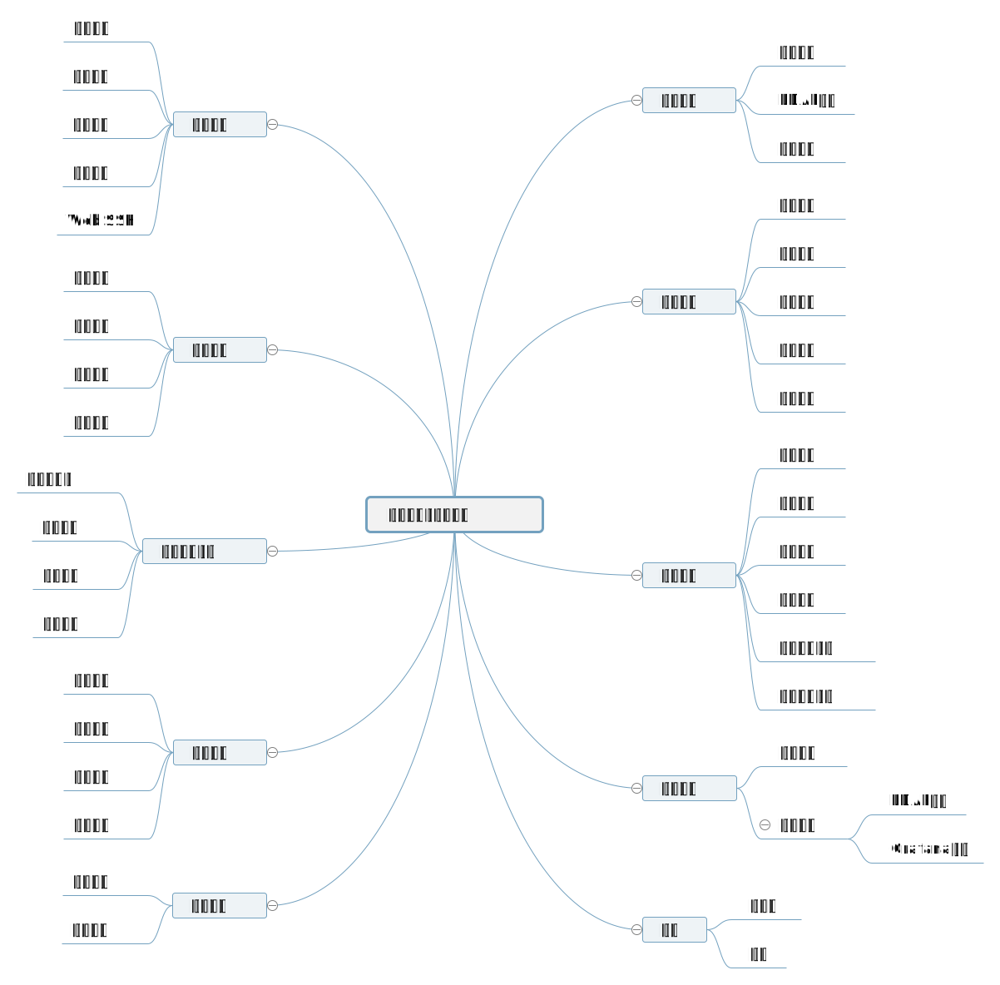

# DevOps-Docker Monorepo

---

[](https://www.travis-ci.com/ZhaoQi99/DevOps-Docker)
[](https://www.codacy.com/gh/ZhaoQi99/DevOps-Docker/dashboard?utm_source=github.com&amp;utm_medium=referral&amp;utm_content=ZhaoQi99/DevOps-Docker&amp;utm_campaign=Badge_Grade)
[](https://github.com/ZhaoQi99/DevOps-Docker/blob/master/LICENSE)


## 简介

Qops-容器管理和监控平台

- [qops-server](./qops_server) - back-end

- [qops-web](./qops_web) - front-end

  

## Contents

*   [安装](#install)
*   [系统架构](#system)
*   [功能](#fetures)
*   [Preview](#preview)
*   [开源协议 & 作者](#license)

## <a name="install"> 安装

### Docker安装

#### 安装`Docker`

```bash
$ yum install docker
$ systemctl start docker
```

#### 安装`MySQL`

```bash
docker pull mysql:5.7
docker run  -p 3306:3306 --name mysql \
	-v "$(pwd)/mysql":/var/lib/mysql \
	-e MYSQL_ROOT_PASSWORD=123456 -d mysql:5.7
```

#### 启动前端

```bash
docker pull zhaoqi99/qops-server:latest
docker run --name=qops-server  --net=host --restart=always -d zhaoqi99/qops-server:latest
```

#### 启动后端

```bash
docker pull zhaoqi99/qops-web:latest
docker run --name=qops-web  --net=host --restart=always -d zhaoqi99/qops-web:latest
```

#### 初始化

```bash
docker exec -it qops-server bash
python manage.py migrate
python manage.py createsuperuser --username aabc  --email "admin@abc.com" # 创建超级用户
```

#### (Optional) 创建其他用户

```
python manage.py adduser -u username -p password
```

### 访问

*   前端:`http://localhost:80`
*   后台Admin:`http://localhost:8000`

## <a name="system">系统架构


## <a name="fetures">功能



## <a name="preview"> Preview

### 账号管理


### 操作日志


### 容器管理&镜像管理


### Web SSH


## <a name="license"> 开源协议 & 作者

- 作者:

  - Qi Zhao([zhaoqi99@outlook.com](mailto:zhaoqi99@outlook.com))

- 开源协议:[GNU General Public License v3.0](https://github.com/ZhaoQi99/DevOps-Docker/blob/master/LICENSE)
